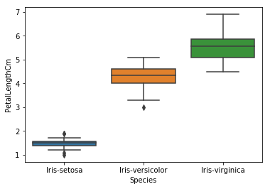
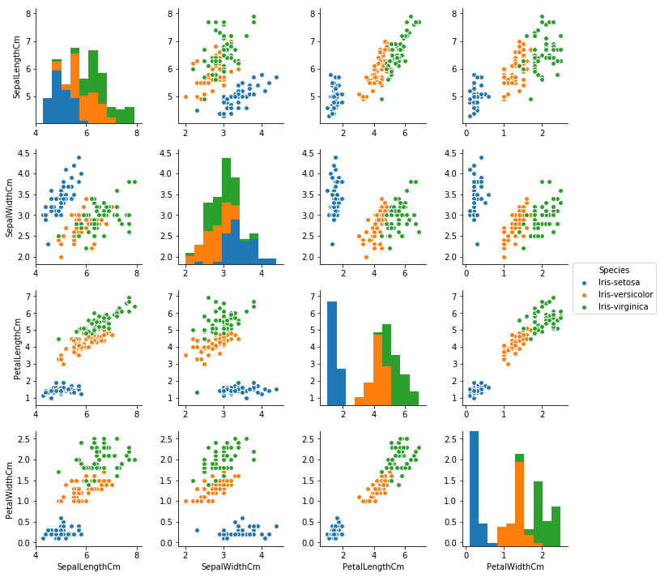
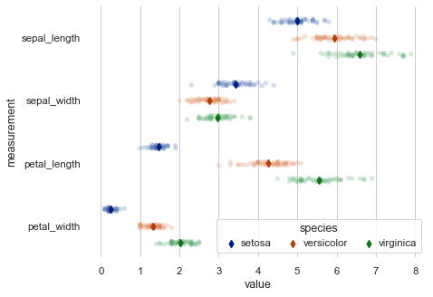

# Welcome to our [team project website!](https://julioveracruz.github.io/testwebsite/)

This is a website to showcase our final project for FIN 377 - Data Science for Finance course at Lehigh University.

To see the complete analysis file(s) click [here](https://github.com/julioveracruz/testwebsite/blob/main/notebooks/example.ipynb).

Maybe you want a different website them for the project? Consider `minimal-mistakes`:
1. [Go here](https://github.com/mmistakes/mm-github-pages-starter/generate).
2. In the resulting repo, click Settings, then Pages, then make sure the source is the main branch.
3. [The doc site is here](https://mmistakes.github.io/minimal-mistakes/docs/structure/) and will help you customize layouts and figure out how to use it.

## Table of contents
1. [Introduction](#introduction)
2. [Methodology](#meth)
3. [Section 2](#section2)
    1. [Subsection](#subsec2-1)
    2. [Subsection](#subsec2-2)
4. [Analysis Section](#section3)
5. [Summary](#summary)

## Introduction  <a name="introduction"></a>

(The "Introduction" text above is formatted in heading 2 style.) The main goal of this project is to explore *(insert project idea here)*.  

## Methodology <a name="meth"></a>

Here is some code that we used to develop our analysis. Blah Blah. [More details are provided in the Appendix](page2).
 
Note that for the purposes of the website, you have to copy this code into the markdown file and  
put the code inside trip backticks with the keyword `python`.

```python
import seaborn as sns 
iris = sns.load_dataset('iris') 

print(iris.head(),  '\n---')
print(iris.tail(),  '\n---')
print(iris.columns, '\n---')
print("The shape is: ",iris.shape, '\n---')
print("Info:",iris.info(), '\n---') # memory usage, name, dtype, and # of non-null obs (--> # of missing obs) per variable
print(iris.describe(), '\n---') # summary stats, and you can customize the list!
print(iris['species'].value_counts()[:10], '\n---')
print(iris['species'].nunique(), '\n---')
```

Notice that the output does NOT show! **You have to copy in figures and tables from the notebooks.**

## Section <a name="section2"></a>
Blah blah

### Subsection 1 <a name="subsec2-1"></a>
This is a subsection, formatted in heading 3 style

### Subsection 2 <a name="subsec2-2"></a>
This is a subsection, formatted in heading 3 style

## Analysis Section <a name="section3"></a>

Here are some graphs that we created in our analysis. We saved them to the `pics/` subfolder and include them via the usual markdown syntax for pictures.


<br><br>
Some analysis here
<br><br>

<br><br>
More analysis here.
<br><br>

<br><br>
More analysis.

## Summary <a name="summary"></a>

Blah blah


## About the team


<br>
Julio is a senior at Lehigh studying finance.
<br><br><br>

<br>
Don is an assistant professor at Lehigh.


## More 

To view the GitHub repo for this website, click [here](https://github.com/donbowen/teamproject).
